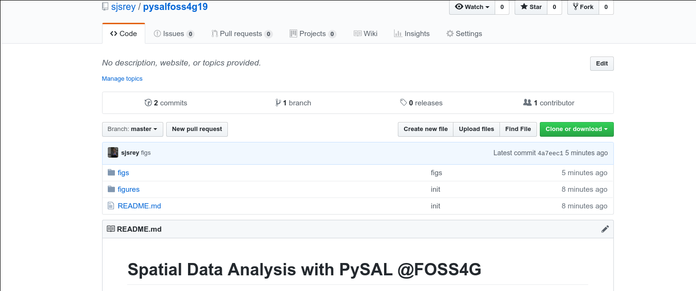
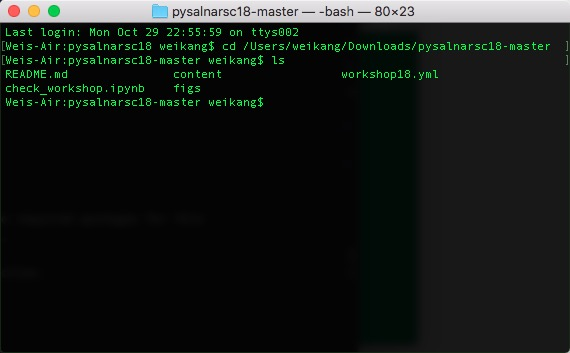

# Spatial Data Science with PySAL @SciPy21

[](https://mybinder.org/v2/gh/sjsrey/pysal-scipy21-2021/master)

### Instructors

* [Sergio Rey](http://sergerey.org) - University of California, Riverside
* [Eli Knaap](https:/knaaptime.com) - University of California, Riverside

---

## Short Description

This repository contains the materials and instructions for the PySAL workshop at [SciPy 2020](https://www.scipy2020.scipy.org/).

Proposed Schedule:

* Fundamentals of Spatial Analysis
  + PySAL Overview
  + Spatial data processing
  + Choropleth mapping and geovisualization
  + Spatial weights
  + Global & Local spatial autocorrelation
    - Break

* Applied Spatial Analysis: Neighborhoods

  + Clustering/Geodemographic Analysis
  + Segregation Analysis


## Long Description

### Fundamentals of Spatial Analysis

#### PySAL Overview

Brief introduction to the PySAL ecosystem of packages for spatial data science

#### Spatial data processing

Reading and writing GIS file formats, spatial data wrangling, changing coordinate transformation systems.

#### Choropleth mapping and geovisualization

Introduction to choropleth map classification using `mapclassify`. Basic visualization with GeoPandas, and matplotlib as well as interactive visualization via folium, leaflet and geoviews/hvplot,

#### Spatial weights

Introduction to the spatial weights matrix for formally encoding geographic relationships.

#### Global & Local spatial autocorrelation

Exploratory spatial data analysis and overview of measures of spatial autocorrelation such as Moran's *I* and the join-count statistic.

### Applied Spatial Analysis of Neighborhoods

#### Clustering/Geodemographic Analysis

Introduction to classic and spatially-constrained geodemographics (regionalization). This module provides an overview of integrating `scikit-learn` and `pysal` to develop socio-demographic cluster models that optionally include a spatial constraint.

#### Segregation Analysis

Applied segregation analysis including the calculation of classic, multigroup, and spatial indices. This module also includes analysis of spatial segregation dynamics, comparative inference, and index decomposition

## Obtaining Workshop Materials

**To get started immediately without installing or downloading anything, click the *"Launch Binder"* button at the top of this page**


---
If you are familiar with GitHub, you should clone or fork this GitHub repository to a specific directory. Cloning can be done by:

``` bash
git clone https://github.com/knaaptime/pysal-scipy20.git
```

If you are not using git, you can grab the workshop materials as a zip file by pointing your browser to (https://github.com/knaaptime/pysal-scipy20.git) and clicking on the green _Clone or download_ button in the upper right.



Extract the downloaded zip file to a working directory.

## Installation

We will be using a number of Python packages for geospatial analysis.

An easy way to install all of these packages is to use a Python distribution such as [Anaconda](https://www.anaconda.com/download/#macos). In this workshop we will use anaconda to build an [environment](https://conda.io/docs/user-guide/tasks/manage-environments.html) for **Python 3.6**. It does not matter which version of anaconda is downloaded. We recommend installing Anaconda 3.7.


On windows, all our work will begin from an anaconda prompt, which you can start as follows:


Start a terminal and navigate to the directory of the downloaded/ cloned materials. For example, if the materials now live in the directory `/Users/knaaptime/Downloads/pysal-scipy20` , you need to navigate to that directory from the terminal (using command `cd` ):



Once we have done that, run:

``` bash
conda-env create -f environment.yml
```

This will build a conda python 3.7 environment that sandboxes the installation of the required packages for this workshop so we don't break anything in your computer's system Python (if it has one).

This may take 10-15 minutes to complete depending on the speed of your network connection.

Once this completes, you can activate the workshop environment with:


``` bash
conda activate pysal-workshop
```

You're now all setup for the tutorial!

## Troubleshooting

If you encounter the following error when starting jupyterlab:

``` bash
FileNotFoundError: [WinError 2] The system cannot find the file specified
```

A solution is to issue the following command in the anaconda prompt:

``` bash
 python -m ipykernel install --user
```

